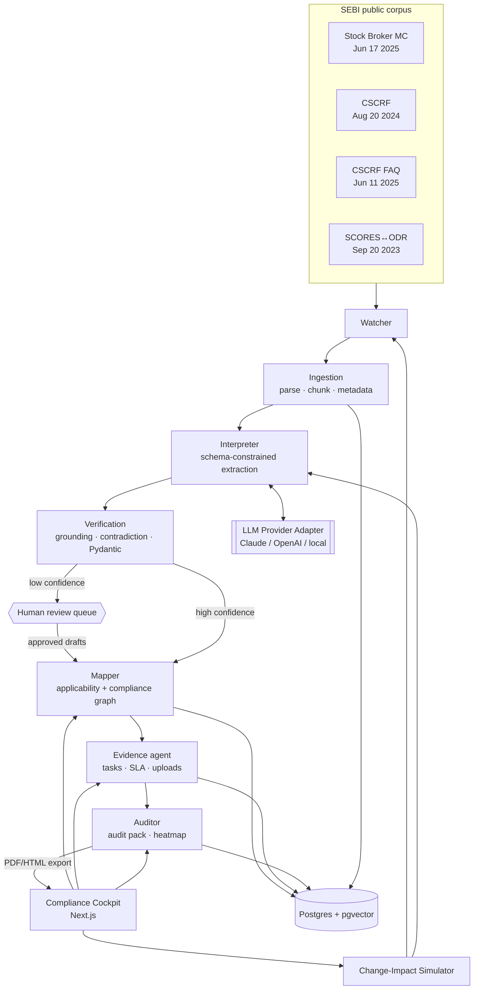
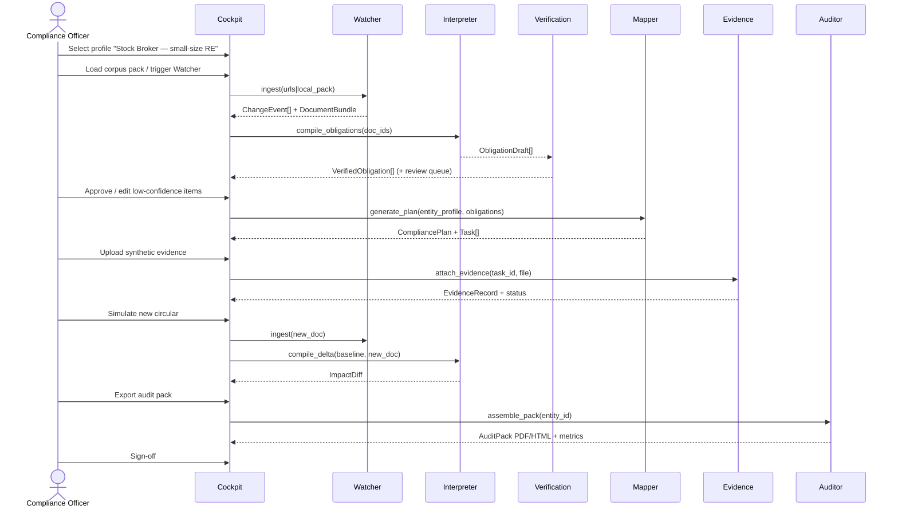

# L5 — Architecture + Corpus Freshness + Tech Stack Field

> **Loop:** Phase 1 / L5  
> **Product:** RegOS Sentinel (PS2 — Agentic Compliance From Regulatory Text to Operational Action)  
> **Date:** 2026-07-10  
> **Sources reconciled:** `flagship_project.md` §8, `winning_product_build_spec.md` §§5–6, `research.md` §§3.2 / 6.4 / 7.4–7.8 / 9–10, `build_plan.md`, `.firecrawl/` SEBI scrapes  
> **Live-link check:** HTTP 200 on all MVP HTML + PDF URLs (curl, 2026-07-10). Firecrawl search unavailable (402 credits); verification via direct fetch.

---

## 0. Executive lock (for Round-01)

| Item | Locked value |
| --- | --- |
| Intermediary | Stock broker (small-size RE first; QSB as contrast in applicability filter) |
| Agents | Watcher → Interpreter → Mapper → Evidence → Auditor (+ Verification layer between Interpreter and Mapper) |
| MVP corpus | Stock Broker Master Circular (Jun 17 2025) + CSCRF (Aug 20 2024) + CSCRF FAQ (Jun 11 2025) + SCORES↔ODR (Sep 20 2023) |
| Stack | Next.js/shadcn · FastAPI · LangGraph · provider-abstracted LLM · Postgres/pgvector · Docker Compose · Vercel + Render/Fly |
| Jul 12 idea round | Architecture + corpus + paste fields only (no running code required) |
| Aug 9 prototype video | End-to-end CSCRF → cited obligations → tasks → evidence → change-sim → audit pack |

**Deltas vs prior docs (this loop):**
1. Architecture diagrams expanded to ASCII + Mermaid with explicit human gates and Verification as a first-class layer (was compressed in `flagship_project.md` §8).
2. Corpus URLs re-verified live; FAQ canonical PDF confirmed; attachment PDFs added; circular numbers extracted from PDFs where HTML omitted them.
3. Obligation / agent I/O schemas expanded from the short example in `research.md` §7.5 into full Pydantic-ready contracts.
4. Jul 12 vs Aug 9 vs finals stretch cut clearly (idea submission ≠ prototype).
5. `regos-sentinel/` scaffold audited (empty dirs); Phase-2 minimal file tree proposed aligned to existing folder names (`web/` not `apps/web/`).

---

## 1. Architecture (submission-ready)

### 1.1 One-paragraph process flow (paste into “Process flow / architecture”)

RegOS Sentinel is a supervised five-agent compliance pipeline. A **Watcher** monitors SEBI circular pages (or loads a curated corpus pack) and emits change events with document metadata. An **Ingestion** layer parses HTML/PDF into clause- and table-aware chunks with title, date, circular number, and source URL. An **Interpreter** agent performs schema-constrained LLM extraction of obligations (actor, action, condition, deadline/frequency, evidence required, applicability, citation span, confidence). A deterministic **Verification** layer grounds every obligation against a retrieved verbatim source span, runs Pydantic/JSON-Schema validation, and flags contradictions or supersessions; low-confidence items route to a human review queue. A **Mapper** agent applies the intermediary profile (stock broker · small-size / qualified RE) to filter applicability and maps Regulation → Obligation → Control → Process → Owner → Evidence into a compliance graph with workflow status. An **Evidence** agent generates owner/SLA tasks, accepts evidence uploads (synthetic in MVP; DigiLocker verify as stretch), and updates the evidence graph. An **Auditor** agent assembles dashboards, a management risk heatmap, and an exportable audit pack (PDF/HTML) with clause citations and human approval logs. Every AI output is decision-support only — not legal advice — and requires officer sign-off before it is treated as an approved compliance action.

### 1.2 ASCII architecture diagram (for deck / one-pager)

```text
┌──────────────────────────────────────────────────────────────────────────┐
│                         RegOS Sentinel (PS2)                             │
│              Agentic Compliance OS — Stock Broker MVP                    │
└──────────────────────────────────────────────────────────────────────────┘

  SEBI public sources (HTML pages + PDF attachments + FAQ PDF)
           │
           │  [1] WATCHER
           │      poll / pack-load · detect new/amended docs · emit ChangeEvent
           ▼
  ┌──────────────────── INGESTION ────────────────────┐
  │  Firecrawl / pdfplumber  ·  clause+table chunking │
  │  metadata: title · date · circular_no · url · hash│
  └────────────────────────┬──────────────────────────┘
                           │ DocumentBundle + Chunks
                           ▼
  ┌──────────────────── INTERPRETER ──────────────────┐
  │  schema-constrained LLM extraction (strict JSON)  │
  │  actor · action · object · condition · deadline   │
  │  frequency · evidence_required · applicability    │
  │  citation{url,clause_id,span,char_offsets} · conf │
  └────────────────────────┬──────────────────────────┘
                           │ ObligationDraft[]
                           ▼
  ┌──────────────────── VERIFICATION ─────────────────┐
  │  retrieval grounding (pgvector) vs source span    │
  │  entailment / contradiction / supersession        │
  │  Pydantic + JSON Schema validation                │
  │  low-confidence → HUMAN REVIEW QUEUE ─────────┐   │
  └────────────────────────┬──────────────────────│───┘
                           │ VerifiedObligation[] │
           ┌───────────────┘                      │
           ▼                                      ▼
  ┌──────── MAPPER ────────┐            Compliance Officer
  │ entity profile filter  │            approve / reject / edit
  │ Reg→Obl→Ctrl→Proc→     │
  │ Owner→Evidence graph   │
  │ status machine         │
  └───────────┬────────────┘
              │ CompliancePlan + Tasks
              ▼
  ┌──────── EVIDENCE AGENT ────────┐
  │ task gen · SLA clocks          │
  │ upload store · status updates  │
  │ (stretch) DigiLocker verify    │
  └───────────┬────────────────────┘
              │ EvidenceGraph
              ▼
  ┌────────── AUDITOR ─────────────┐
  │ gap / contradiction flags      │
  │ risk heatmap · audit pack PDF  │
  │ (stretch) SupTech aggregate    │
  └───────────┬────────────────────┘
              │
              ▼
     Human sign-off (Compliance Head)
     Export · metrics overlay · change-impact simulator
```

**Status machine (task / obligation operational states):**  
`not_started` → `assigned` → `evidence_pending` → `under_review` → `approved` | `exception` | `rejected`

### 1.3 Mermaid — system architecture



### 1.4 Mermaid — agent sequence (happy path)



### 1.5 Component map (backend pieces ↔ agents)

| Component (`winning_product_build_spec` §5) | Owner agent / layer | Jul 12 | Aug 9 MVP | Finals stretch |
| --- | --- | --- | --- | --- |
| Document loader | Watcher + Ingestion | Spec only | Preloaded 3–5 docs | Live poll of SEBI pages |
| Parser (clause/table) | Ingestion | Spec | Real parse + manual fix layer | Hardened table OCR |
| Retrieval / grounding | Verification | Spec | pgvector citation check | Stronger entailment model |
| Obligation extractor | Interpreter | Schema locked | Strict JSON LLM | Multi-doc batch + IA corpus |
| Applicability engine | Mapper | Spec | Rules + simple classifier | Learned thresholds |
| Task generator | Mapper + Evidence | Spec | Owner/deadline/evidence tasks | Jira/Slack connectors |
| Evidence store | Evidence | Spec | Local/S3 synthetic uploads | DigiLocker verify |
| Change-impact simulator | Watcher + Interpreter + Mapper | Storyboard | One new-circular diff | Continuous Watcher |
| Audit export | Auditor | Spec | PDF/HTML pack | Policy-as-code (OPA/YAML) |
| Metrics overlay | Auditor / UI | Numbers in pitch | Live overlay in demo | Benchmark screen |
| SupTech view | Auditor | Mention | Cut | Anonymized aggregate |

---

## 2. Corpus list (verified 2026-07-10)

### 2.1 MVP corpus (must cite in submission)

| # | Document | Date | Circular / ref | HTML page (canonical) | PDF attachment | Live? | Role in demo |
| --- | --- | --- | --- | --- | --- | --- | --- |
| 1 | **Master Circular for Stock Brokers** | Jun 17, 2025 | `SEBI/HO/MIRSD/MIRSD-PoD/P/CIR/2025/90` | https://www.sebi.gov.in/legal/master-circulars/jun-2025/master-circular-for-stock-brokers_94623.html | https://www.sebi.gov.in/sebi_data/attachdocs/jun-2025/1750158789381.pdf | **200** HTML + PDF | Consolidated broker obligations; entity baseline |
| 2 | **CSCRF for SEBI REs** | Aug 20, 2024 | `SEBI/HO/ITD-1/ITD_CSC_EXT/P/CIR/2024/113` | https://www.sebi.gov.in/legal/circulars/aug-2024/cybersecurity-and-cyber-resilience-framework-cscrf-for-sebi-regulated-entities-res-_85964.html | https://www.sebi.gov.in/sebi_data/attachdocs/aug-2024/1724326790365.pdf | **200** HTML + PDF | Primary extraction corpus; evidence-heavy controls; size-tier applicability |
| 3 | **CSCRF FAQ** (+ Cloud Framework FAQ) | Jun 11, 2025 | Guidance on CSCRF 2024/113 (not a circular; FAQ PDF) | Index: https://sebi.gov.in/sebiweb/other/OtherAction.do?doFaq=yes | https://www.sebi.gov.in/sebi_data/faqfiles/jun-2025/1749647139924.pdf | **200** PDF + FAQ index | Clarifies thresholds, VAPT/audit periodicity, logs, SOC — boosts extraction precision |
| 4 | **SCORES ↔ ODR linkage** | Sep 20, 2023 | `SEBI/HO/OIAE/IGRD/CIR/P/2023/156` | https://www.sebi.gov.in/legal/circulars/sep-2023/redressal-of-investor-grievances-through-the-sebi-complaint-redressal-scores-platform-and-linking-it-to-online-dispute-resolution-platform_77159.html | https://www.sebi.gov.in/sebi_data/attachdocs/sep-2023/1695456916964.pdf | **200** HTML + PDF | SLA / ATR 21-day workflow demo; grievance evidence trail |

**Local mirrors already scraped:**  
`.firecrawl/sebi-master-circular-stock-brokers-2025.json`, `sebi-cscrf-2024-page.json`, `sebi-cscrf-faq-2025.md`, `sebi-scores-odr-linkage-2023.json`

### 2.2 Supporting / optional (stretch or simulator fuel)

| Document | Date | URL | Live? | Use |
| --- | --- | --- | --- | --- |
| ODR Master Circular | Aug 11, 2023 | https://www.sebi.gov.in/legal/master-circulars/aug-2023/online-resolution-of-disputes-in-the-indian-securities-market_75220.html | **200** | Background for SCORES↔ODR; not required in MVP pack |
| Technical Clarifications to CSCRF | Aug 28, 2025 | https://www.sebi.gov.in/legal/circulars/aug-2025/technical-clarifications-to-cybersecurity-and-cyber-resilience-framework-cscrf-for-sebi-regulated-entities-res-_96329.html | **200** | Strong change-impact simulator input (post-CSCRF delta) |
| Master Circular for Investment Advisers | Feb 06, 2026 | https://www.sebi.gov.in/legal/master-circulars/feb-2026/master-circular-for-investment-advisers_99569.html | **200** | 2nd intermediary corpus (scalability proof) |
| Master Circular on Surveillance | May 15, 2026 | https://www.sebi.gov.in/legal/master-circulars/may-2026/master-circular-on-surveillance-of-securities-market_101473.html | **200** | Alternate simulator circular |
| Master Circulars listing | — | https://www.sebi.gov.in/sebiweb/home/HomeAction.do?doListing=yes&sid=1&ssid=6&smid=0 | Scraped | Watcher discovery feed |

### 2.3 Paste-ready corpus blurb (submission field)

> **Regulatory corpus (public SEBI documents only):**  
> (1) Master Circular for Stock Brokers dated June 17, 2025 (`SEBI/HO/MIRSD/MIRSD-PoD/P/CIR/2025/90`) — https://www.sebi.gov.in/legal/master-circulars/jun-2025/master-circular-for-stock-brokers_94623.html  
> (2) Cybersecurity and Cyber Resilience Framework (CSCRF) for SEBI Regulated Entities dated August 20, 2024 (`SEBI/HO/ITD-1/ITD_CSC_EXT/P/CIR/2024/113`) — https://www.sebi.gov.in/legal/circulars/aug-2024/cybersecurity-and-cyber-resilience-framework-cscrf-for-sebi-regulated-entities-res-_85964.html  
> (3) FAQs on CSCRF and Cloud Framework dated June 11, 2025 — https://www.sebi.gov.in/sebi_data/faqfiles/jun-2025/1749647139924.pdf  
> (4) SCORES Platform redressal and linkage to ODR dated September 20, 2023 (`SEBI/HO/OIAE/IGRD/CIR/P/2023/156`) — https://www.sebi.gov.in/legal/circulars/sep-2023/redressal-of-investor-grievances-through-the-sebi-complaint-redressal-scores-platform-and-linking-it-to-online-dispute-resolution-platform_77159.html  
> Intermediary data and evidence artifacts in the prototype are **synthetic**. No personal data / no non-public SEBI data.

### 2.4 Freshness notes / risks

| Risk | Status | Mitigation |
| --- | --- | --- |
| SEBI renumbers/replaces master circulars | Stock Broker MC supersedes Aug 09 2024 MC (stated in PDF) | Pin by circular number + content hash in Watcher; re-scrape before Aug video |
| CSCRF clarifications continue (Apr 2025 thresholds; Aug 2025 technical clarifications) | FAQ + technical clarifications exist | Treat clarifications as delta docs for simulator; do not pretend FAQ is binding law (FAQ itself disclaims interpretation) |
| FAQ URL is under `sebi_data/faqfiles/` (opaque numeric filename) | Confirmed live PDF `1749647139924.pdf` | Also cite FAQ index page; store local copy in `corpus/` |
| Firecrawl search 402 during this loop | Direct curl verification succeeded | Re-run Firecrawl scrape in Phase 2 when credits available |

---

## 3. Paste-ready “Technology stack details” field

### 3.1 Short form (~1,200–1,800 chars — typical portal field)

> **Technology stack — RegOS Sentinel**  
> Frontend: Next.js (App Router), React, Tailwind CSS, shadcn/ui — Compliance Cockpit with split-pane source viewer, obligation table, Kanban workflow, evidence locker, and audit export.  
> Backend: Python FastAPI exposing ingest / compile / map / evidence / audit / simulate APIs.  
> Agents: LangGraph (or equivalent explicit state machine) orchestrating five supervised agents — Watcher, Interpreter, Mapper, Evidence, Auditor — with replayable step logs and human approval gates.  
> AI/NLP: Schema-constrained LLM extraction (strict JSON / tool-calling) + pgvector retrieval grounding so every displayed obligation cites a verbatim source span; hybrid rules+classifier for applicability; confidence scoring and contradiction/supersession checks.  
> LLM policy: Claude API (hackathon default) behind a **provider abstraction** (`LLMProvider` interface) so the same pipeline can swap to OpenAI, Azure OpenAI, or open-weight/on-prem (Ollama/vLLM) if organizers restrict hosted models — no business logic couples to one vendor.  
> Data: PostgreSQL for obligations, tasks, evidence, audit logs; pgvector for clause embeddings; local/S3-compatible object store for evidence files; optional Neo4j view for the compliance graph.  
> Parsing: Firecrawl + pdfplumber for SEBI HTML/PDF; pluggable parser interface.  
> Validation: Pydantic models + JSON Schema + citation-coverage tests; labeled 50–100 obligation benchmark (precision/recall/citation accuracy).  
> Auth / trust: Role-based access (Compliance Officer, CISO, Management, Regulator-view); full agent+human audit trail; DPDP-aligned posture (public corpus + synthetic intermediary data only).  
> Deploy: Docker Compose for reproducible demo; Vercel (web) + Render/Fly (API+DB); offline seeded fallback for jury.  
> Stretch DPI: DigiLocker-style evidence verification mock for rubric coverage — not required for MVP.

### 3.2 Long form (deck appendix / README)

| Layer | Choice | Why |
| --- | --- | --- |
| Frontend | Next.js + React + Tailwind + shadcn/ui | Fast B2B dashboard; Anshu-native; judge-readable surfaces |
| Backend | FastAPI | Typed Python agents + Pydantic schemas share one language |
| Orchestration | LangGraph / explicit agent graph | On-theme “agentic”; each node logged & replayable |
| LLM | Provider-abstracted (Claude default) | Speed now; policy-safe swap path |
| Embeddings / RAG | pgvector | Citation grounding without extra infra |
| Primary DB | Postgres | Obligations, tasks, approvals, audit logs |
| Graph view | Optional Neo4j | Visual Reg→…→Evidence for demo; not MVP-blocking |
| Files | Local disk / S3-compatible | Synthetic evidence uploads |
| PDF export | WeasyPrint or Playwright HTML→PDF | Audit pack |
| Ingestion | Firecrawl + pdfplumber | Real SEBI pages/PDFs |
| Containers | Docker Compose | One-command jury demo |
| Hosting | Vercel + Render/Fly | Live link + API |
| Eval | `services/api/eval` harness | Precision/recall slide judges trust |

**Explicit non-goals for stack:** native mobile, blockchain ledger, live broker OMS integrations, production DigiLocker federation.

---

## 4. MVP vs stretch (Jul 12 idea · Aug 9 video · finals)

### 4.1 Round-01 idea submission — **due Jul 12, 2026** (THIS WEEK)

**Deliverables (no running product required):**
- Problem + solution narrative (PS2 / RegOS)
- Architecture diagram (ASCII + Mermaid above)
- Agentic pipeline description (5 agents + human gates)
- Corpus list with live public URLs (§2)
- Technology stack field (§3)
- Process flow field (§1.1)
- Demo storyboard / ≤3 min video plan (L3/L4)
- Commercial / sandbox note (L6)

**Out of scope for Jul 12:** working extraction, live deploy, labeled benchmark UI.

### 4.2 Prototype MVP — **Aug 9 solution video**

Must ship (aligned to `flagship_project.md` §6 + `winning_product_build_spec.md` §7):

1. Compliance Cockpit home (entity = Stock Broker — small-size RE).  
2. Load **4** public docs (Stock Broker MC + CSCRF + FAQ + SCORES↔ODR).  
3. Interpreter → obligation table with **100% citation coverage** on displayed rows.  
4. Source viewer: click obligation → highlight clause + confidence + review status.  
5. Applicability filter (in-scope / out-of-scope with reason).  
6. Mapper → owner/deadline/evidence tasks (CISO / Compliance / Ops / Grievance).  
7. Evidence locker: upload synthetic artifacts; status workflow.  
8. Change-impact simulator on **one** new circular (prefer CSCRF technical clarifications Aug 2025 or SCORES↔ODR as delta).  
9. Auditor → audit pack export (PDF/HTML) + metrics overlay (docs · obligations · citation % · time-to-plan).  
10. Human approval gates visible in UI.

**Target metrics (demo overlay):** docs 4 · obligations ~80–150 · citation coverage 100% displayed · time-to-first-plan &lt; 3 min · extraction precision ≥ 0.85 on labeled sample.

### 4.3 Stretch — **finals (post Aug 21 / GFF)**

| Stretch item | Rubric tick |
| --- | --- |
| Live Watcher polling SEBI listing pages | Stronger agentic story |
| SupTech anonymized aggregate dashboard | SEBI/MII judge appeal |
| DigiLocker / VC evidence verify mock | DPI |
| Jira / Slack / email connector mocks | Enterprise integration |
| Multilingual explainer (EN/HI) | Inclusion |
| Policy-as-code export (OPA/YAML) | Differentiator vs dashboards |
| Investment Adviser 2nd corpus | Scalability proof |
| Neo4j graph visualization polish | Visual wow |

### 4.4 Cut-first list (if Aug sprint slips)

| Keep | Cut first |
| --- | --- |
| CSCRF + FAQ path to audit pack | Full Stock Broker MC coverage |
| 30–50 high-quality labeled obligations | 150+ obligations |
| One-doc change simulator | Continuous Watcher |
| Citation source viewer | Graph animations / Neo4j |
| Synthetic evidence upload | Live connectors / DigiLocker |
| Stock-broker profile only | IA second corpus |

---

## 5. Exact agent I/O schemas

Conventions: snake_case JSON; ISO-8601 timestamps; UUIDs as strings; confidence ∈ [0,1]; all LLM outputs validated by Pydantic before persistence.

### 5.1 Shared enums

```json
{
  "human_status": ["draft", "pending_review", "approved", "rejected", "edited"],
  "task_status": ["not_started", "assigned", "evidence_pending", "under_review", "approved", "exception", "rejected"],
  "entity_category": ["stock_broker", "investment_adviser", "mii", "other_re"],
  "size_tier": ["small_size_re", "mid_size_re", "qualified_re", "qsb", "mii"],
  "risk_domain": ["cybersecurity", "grievance", "conduct", "operations", "surveillance", "other"],
  "impact_type": ["added", "amended", "superseded", "removed", "unchanged"]
}
```

### 5.2 Citation (required on every displayed obligation)

```json
{
  "citation": {
    "source_doc_id": "CSCRF-2024-113",
    "url": "https://www.sebi.gov.in/legal/circulars/aug-2024/cybersecurity-and-cyber-resilience-framework-cscrf-for-sebi-regulated-entities-res-_85964.html",
    "circular_no": "SEBI/HO/ITD-1/ITD_CSC_EXT/P/CIR/2024/113",
    "clause_id": "§4.4 / Table 21",
    "page": 42,
    "span": "verbatim quote from source ≤ 500 chars",
    "char_start": 12040,
    "char_end": 12210,
    "chunk_id": "cscrf-chunk-118",
    "grounding_score": 0.93
  }
}
```

### 5.3 Watcher

**Input — `WatcherIn`**
```json
{
  "mode": "pack_load | poll | simulate",
  "seed_urls": ["https://www.sebi.gov.in/..."],
  "local_paths": ["corpus/cscrf-2024.pdf"],
  "since": "2024-08-01T00:00:00Z",
  "baseline_doc_ids": ["CSCRF-2024-113"]
}
```

**Output — `ChangeEvent` / `DocumentBundle`**
```json
{
  "event_id": "evt_01",
  "event_type": "new | amended | unchanged | removed",
  "detected_at": "2026-07-10T10:00:00Z",
  "document": {
    "doc_id": "CSCRF-2024-113",
    "title": "Cybersecurity and Cyber Resilience Framework (CSCRF) for SEBI Regulated Entities (REs)",
    "circular_no": "SEBI/HO/ITD-1/ITD_CSC_EXT/P/CIR/2024/113",
    "published_on": "2024-08-20",
    "url": "https://www.sebi.gov.in/legal/circulars/aug-2024/...",
    "pdf_url": "https://www.sebi.gov.in/sebi_data/attachdocs/aug-2024/1724326790365.pdf",
    "content_hash": "sha256:...",
    "mime": "application/pdf",
    "parser": "pdfplumber",
    "chunk_count": 240
  },
  "diff_summary": "Optional vs baseline: sections added/changed"
}
```

### 5.4 Interpreter

**Input — `InterpreterIn`**
```json
{
  "doc_id": "CSCRF-2024-113",
  "chunks": [{"chunk_id": "cscrf-chunk-118", "text": "...", "clause_path": "§3.2"}],
  "entity_hint": {"category": "stock_broker", "size_tier": "small_size_re"},
  "extract_limit": 150,
  "schema_version": "obligation.v1"
}
```

**Output — `ObligationDraft` (core obligation JSON)**
```json
{
  "obligation_id": "CSCRF-PR-AA-S8-001",
  "schema_version": "obligation.v1",
  "source_doc_id": "CSCRF-2024-113",
  "source_title": "SEBI CSCRF Aug 20 2024",
  "actor": "Small-size stock broker / CISO",
  "action": "Maintain inventory of log sources and protect identified logs",
  "object": "system and application logs for critical systems",
  "condition": "Applicable to REs as per CSCRF size categorization; see FAQ thresholds",
  "deadline": null,
  "frequency": "continuous",
  "sla_days": null,
  "evidence_required": [
    "log source inventory",
    "retention policy",
    "access-control review"
  ],
  "applicability": {
    "entity_categories": ["stock_broker"],
    "size_tiers": ["small_size_re", "mid_size_re", "qualified_re", "qsb"],
    "in_scope_default": true,
    "exclusion_reason": null
  },
  "owner_role_suggested": "CISO",
  "control_theme": "log_management",
  "risk_domain": "cybersecurity",
  "severity": "medium",
  "citation": { "$ref": "Citation" },
  "confidence": 0.86,
  "model": {"provider": "anthropic", "name": "claude-sonnet-4", "prompt_hash": "…"},
  "human_status": "pending_review",
  "created_at": "2026-07-10T10:05:00Z"
}
```

**Field dictionary (obligation.v1) — judge-facing**

| Field | Type | Required | Notes |
| --- | --- | --- | --- |
| `obligation_id` | string | yes | Stable ID; prefix by corpus |
| `source_doc_id` | string | yes | FK to document |
| `actor` | string | yes | Who must act |
| `action` | string | yes | What must be done |
| `object` | string | no | What the action applies to |
| `condition` | string | yes | When / if applicable |
| `deadline` | string\|null | no | Absolute or relative date text |
| `frequency` | string\|null | no | continuous / annual / half-yearly / … |
| `sla_days` | int\|null | no | e.g. SCORES ATR = 21 |
| `evidence_required` | string[] | yes | Artifacts that prove compliance |
| `applicability` | object | yes | Entity/size scope |
| `owner_role_suggested` | string | yes | CISO / Compliance / Ops / Grievance |
| `control_theme` | string | no | Mapping key |
| `risk_domain` | enum | yes | See enums |
| `severity` | enum | yes | low/medium/high/critical |
| `citation` | object | **yes** | No citation → cannot display |
| `confidence` | float | yes | &lt; threshold → review queue |
| `human_status` | enum | yes | Gate state |

### 5.5 Verification

**Input:** `ObligationDraft[]` + chunk store  
**Output — `VerifiedObligation`**
```json
{
  "obligation_id": "CSCRF-PR-AA-S8-001",
  "validation": {
    "schema_ok": true,
    "citation_ok": true,
    "span_found": true,
    "grounding_score": 0.93,
    "contradiction_flags": [],
    "supersession_flags": []
  },
  "route": "auto_accept | human_review | reject",
  "verified_at": "2026-07-10T10:06:00Z"
}
```

**Gate rule (MVP):** `citation_ok && schema_ok && (confidence ≥ 0.80 || human_status == approved)`.

### 5.6 Mapper

**Input — `MapperIn`**
```json
{
  "entity_profile": {
    "entity_id": "demo-broker-001",
    "legal_name": "Demo Securities Pvt Ltd (synthetic)",
    "category": "stock_broker",
    "size_tier": "small_size_re",
    "is_qsb": false,
    "processes": ["cyber_ops", "grievance", "trading_ops"],
    "owners": [
      {"role": "CISO", "name": "A. Sharma"},
      {"role": "Compliance Officer", "name": "B. Patel"},
      {"role": "Grievance Officer", "name": "C. Khan"}
    ]
  },
  "obligations": ["CSCRF-PR-AA-S8-001"]
}
```

**Output — `CompliancePlan` + `Task`**
```json
{
  "plan_id": "plan_demo_001",
  "entity_id": "demo-broker-001",
  "nodes": {
    "regulation": "CSCRF-2024-113",
    "obligation_id": "CSCRF-PR-AA-S8-001",
    "control_id": "CTRL-LOG-001",
    "process_id": "PROC-CYBER-OPS",
    "owner_role": "CISO",
    "evidence_types": ["log source inventory", "retention policy"]
  },
  "applicability_result": {
    "in_scope": true,
    "reason": "Clause applies to small-size REs per CSCRF categorization / FAQ"
  },
  "task": {
    "task_id": "task_001",
    "obligation_id": "CSCRF-PR-AA-S8-001",
    "title": "Produce log source inventory and retention policy",
    "owner_role": "CISO",
    "due_at": "2026-08-01",
    "status": "assigned",
    "severity": "medium",
    "evidence_required": ["log source inventory", "retention policy"]
  }
}
```

### 5.7 Evidence agent

**Input — `EvidenceIn`**
```json
{
  "task_id": "task_001",
  "uploader_role": "CISO",
  "file": {
    "filename": "log_inventory_synthetic.csv",
    "content_type": "text/csv",
    "storage_uri": "file://seed/evidence/log_inventory_synthetic.csv"
  },
  "notes": "Synthetic inventory for demo"
}
```

**Output — `EvidenceRecord`**
```json
{
  "evidence_id": "ev_001",
  "task_id": "task_001",
  "obligation_id": "CSCRF-PR-AA-S8-001",
  "filename": "log_inventory_synthetic.csv",
  "storage_uri": "file://...",
  "uploaded_at": "2026-07-10T10:20:00Z",
  "uploader_role": "CISO",
  "verification": {
    "method": "manual | hash | digilocker_mock",
    "status": "pending | verified | rejected",
    "verified_by": null
  },
  "task_status_after": "under_review"
}
```

### 5.8 Auditor

**Input — `AuditorIn`**
```json
{
  "entity_id": "demo-broker-001",
  "include": ["obligations", "citations", "tasks", "evidence", "approvals", "exceptions", "metrics"]
}
```

**Output — `AuditPack`**
```json
{
  "pack_id": "audit_001",
  "generated_at": "2026-07-10T10:30:00Z",
  "entity_profile": {"$ref": "EntityProfile"},
  "corpus": [{"doc_id": "CSCRF-2024-113", "url": "...", "circular_no": "..."}],
  "obligations": [{"$ref": "ObligationDraft"}],
  "evidence": [{"$ref": "EvidenceRecord"}],
  "approvals": [
    {
      "object_type": "obligation",
      "object_id": "CSCRF-PR-AA-S8-001",
      "actor": "Compliance Officer",
      "decision": "approved",
      "at": "2026-07-10T10:15:00Z"
    }
  ],
  "gaps": [{"obligation_id": "...", "missing_evidence": ["VAPT closure"]}],
  "risk_heatmap": {"cybersecurity": "amber", "grievance": "green"},
  "metrics": {
    "docs_ingested": 4,
    "obligations_extracted": 112,
    "citation_coverage_displayed": 1.0,
    "precision_sample": 0.88,
    "time_to_plan_seconds": 142
  },
  "disclaimer": "Decision-support only. Not legal advice. Human officer sign-off required.",
  "export_uri": "file://exports/audit_001.pdf"
}
```

### 5.9 Change-impact simulator

**Output — `ImpactDiff`**
```json
{
  "baseline_doc_ids": ["CSCRF-2024-113"],
  "new_doc_id": "CSCRF-TECH-CLAR-2025-119",
  "added": [{"obligation_id": "...", "impact_type": "added"}],
  "amended": [{"obligation_id": "...", "impact_type": "amended", "field_diffs": ["frequency", "evidence_required"]}],
  "superseded": [],
  "controls_impacted": ["CTRL-LOG-001"],
  "owners_impacted": ["CISO"],
  "tasks_generated": ["task_088"],
  "risk_score_delta": 0.07,
  "summary": "3 new obligations, 5 amended; CISO workload +2 tasks"
}
```

---

## 6. Provider abstraction (hosted-LLM policy risk)

### 6.1 Risk statement

Organizers may disallow hosted LLM APIs (Claude/OpenAI) for data-residency, confidentiality, or fairness reasons (`research.md` §2.8 / §9). Coupling extraction prompts to one vendor would force a late rewrite.

### 6.2 Mitigation design (must appear in architecture narrative)

```text
agents/*  ──calls──▶  llm/provider.py  ──▶  AnthropicAdapter
                         │                  OpenAIAdapter
                         │                  AzureOpenAIAdapter
                         └────────────────▶  LocalOpenWeightAdapter
                                              (Ollama / vLLM / llama.cpp)
```

**Interface (conceptual):**
```python
class LLMProvider(Protocol):
    def complete_json(self, prompt: str, schema: dict, **kw) -> dict: ...
    def embed(self, texts: list[str]) -> list[list[float]]: ...

# Config via env — no code fork:
# LLM_PROVIDER=anthropic|openai|azure|ollama
# LLM_MODEL=...
# LLM_BASE_URL=...   # for local/compatible endpoints
```

### 6.3 Submission wording (1–2 sentences)

> Extraction and grounding call an `LLMProvider` interface. The hackathon default is Anthropic Claude for speed, but the same LangGraph nodes can target OpenAI, Azure OpenAI, or a local open-weight endpoint without changing obligation schemas or human-gate logic — addressing hosted-LLM policy risk.

### 6.4 What stays provider-agnostic

- Obligation JSON schema & Pydantic models  
- Citation grounding (embedding model also swappable)  
- Applicability rules  
- Workflow / audit logs  
- UI  

Only adapters + prompt packaging change.

---

## 7. `regos-sentinel/` scaffold audit + Phase-2 minimal file tree

### 7.1 Current state (2026-07-10)

```text
regos-sentinel/
├── corpus/          # empty
├── docs/            # empty
├── seed/            # empty
├── services/
│   └── api/
│       ├── agents/      # empty
│       ├── eval/        # empty
│       └── retrieval/   # empty
└── web/             # empty
```

No `package.json`, `pyproject.toml`, `docker-compose.yml`, or source files. Scaffold dirs exist but are hollow. Prefer **filling this tree** over renaming to `apps/web` (avoids churn); document `web/` ≡ Next.js app.

### 7.2 Proposed minimal Phase-2 file tree

```text
regos-sentinel/
├── README.md
├── docker-compose.yml          # api + postgres(pgvector) + web
├── .env.example                # LLM_PROVIDER, DATABASE_URL, …
├── .gitignore
│
├── web/                        # Next.js App Router
│   ├── package.json
│   ├── next.config.ts
│   ├── tailwind.config.ts
│   ├── src/
│   │   ├── app/
│   │   │   ├── layout.tsx
│   │   │   ├── page.tsx                 # Compliance Cockpit home
│   │   │   ├── obligations/page.tsx
│   │   │   ├── source/[id]/page.tsx    # split-pane viewer
│   │   │   ├── workflow/page.tsx        # Kanban
│   │   │   ├── evidence/page.tsx
│   │   │   ├── simulate/page.tsx
│   │   │   └── audit/page.tsx
│   │   ├── components/                  # ObligationTable, CitationPane, …
│   │   └── lib/api.ts                   # typed client to FastAPI
│   └── public/
│
├── services/api/
│   ├── pyproject.toml / requirements.txt
│   ├── Dockerfile
│   ├── app/
│   │   ├── main.py                      # FastAPI entry
│   │   ├── deps.py
│   │   ├── routes/
│   │   │   ├── ingest.py
│   │   │   ├── compile.py
│   │   │   ├── map.py
│   │   │   ├── evidence.py
│   │   │   ├── audit.py
│   │   │   └── simulate.py
│   │   ├── agents/
│   │   │   ├── graph.py                 # LangGraph wiring
│   │   │   ├── watcher.py
│   │   │   ├── interpreter.py
│   │   │   ├── mapper.py
│   │   │   ├── evidence.py
│   │   │   └── auditor.py
│   │   ├── schemas/
│   │   │   ├── obligation.py            # obligation.v1 Pydantic
│   │   │   ├── task.py
│   │   │   ├── evidence.py
│   │   │   ├── document.py
│   │   │   └── audit.py
│   │   ├── llm/
│   │   │   ├── base.py                  # LLMProvider protocol
│   │   │   ├── anthropic.py
│   │   │   ├── openai_compat.py
│   │   │   └── local.py
│   │   ├── retrieval/
│   │   │   ├── chunker.py
│   │   │   ├── store.py                 # pgvector
│   │   │   └── ground.py                # citation validator
│   │   ├── verification/
│   │   │   └── pipeline.py
│   │   └── eval/
│   │       ├── labeled_obligations.jsonl
│   │       └── harness.py               # precision/recall/citation
│   └── tests/
│       ├── test_schema.py
│       └── test_grounding.py
│
├── corpus/
│   ├── manifest.json                    # doc_id → url, hash, circular_no
│   ├── stock-broker-mc-2025-06-17.pdf
│   ├── cscrf-2024-08-20.pdf
│   ├── cscrf-faq-2025-06-11.pdf
│   ├── scores-odr-2023-09-20.pdf
│   └── parsed/                          # optional markdown/json chunks
│
├── seed/
│   ├── entity_profile.json              # small-size stock broker
│   ├── process_inventory.json
│   └── evidence/
│       ├── log_inventory_synthetic.csv
│       ├── vapt_report_synthetic.pdf
│       ├── grievance_sla_log.csv
│       └── board_note_synthetic.pdf
│
└── docs/
    ├── ARCHITECTURE.md                  # copy of §1 diagrams
    ├── MODEL_CARD.md
    ├── RISK_REGISTER.md
    ├── DPDP_STATEMENT.md
    ├── HUMAN_IN_THE_LOOP.md
    └── CORPUS.md                        # copy of §2 URL table
```

### 7.3 Phase-2 first commits (suggested order)

1. `manifest.json` + download scripts for the four MVP PDFs (pin hashes).  
2. Pydantic `obligation.v1` + golden fixture JSON.  
3. `LLMProvider` stub + Interpreter spike → 10 cited obligations from CSCRF.  
4. FastAPI `/compile` + minimal Next.js obligation table + source pane.  
5. Mapper tasks + evidence upload + audit HTML export.  
6. Change-impact on one delta doc.  
7. Docker Compose + README demo script.

---

## 8. Rubric mapping (why this architecture scores)

| Criterion | How architecture hits it |
| --- | --- |
| Market Impact | Circular → owner/deadline/evidence in minutes; measurable time-to-plan |
| Technology Stack | Agentic AI + NLP + retrieval + workflow + (stretch) DPI |
| Feasibility | Public corpus + synthetic data + narrow stock-broker MVP |
| Scalability | Same `obligation.v1` schema → IA / RTA / AMC / MII |
| SEBI Mandate | Intermediary accountability, investor grievance SLAs, cyber resilience |

**Anti-RAG contrast line (use in pitch):**  
> Not “chat with circulars.” Five agents produce a cited obligation graph, human-approved tasks, evidence, and an audit pack — every line traceable to a SEBI clause.

---

## 9. Open items for organizers / next loops

| Item | Owner | Needed by |
| --- | --- | --- |
| Confirm hosted LLM allowed | PM (webinar Q) | Before Aug sprint lock |
| Whether Round-01 wants diagram as image vs text | L2 submission copy | Jul 12 |
| Prefer simulator delta = CSCRF technical clarifications (Aug 2025) vs SCORES | L4 video | Jul 13+ |
| Re-scrape corpus with Firecrawl when credits restore | BE | Phase 2 day 1 |

---

## 10. Checklist — L5 exit gate

- [x] ASCII architecture refined for submission  
- [x] Mermaid system + sequence diagrams  
- [x] Corpus URLs verified live (HTML + PDFs + FAQ) with circular numbers  
- [x] Paste-ready Technology stack field (short + long)  
- [x] Paste-ready Process flow / architecture paragraph  
- [x] Jul 12 vs Aug 9 vs finals stretch specified  
- [x] Exact agent I/O / obligation.v1 schemas  
- [x] Provider-abstraction note for hosted-LLM risk  
- [x] `regos-sentinel/` empty scaffold audited + Phase-2 file tree  

**L5 status: COMPLETE — ready for L2 to paste stack/architecture fields and for Phase-2 scaffold fill.**
